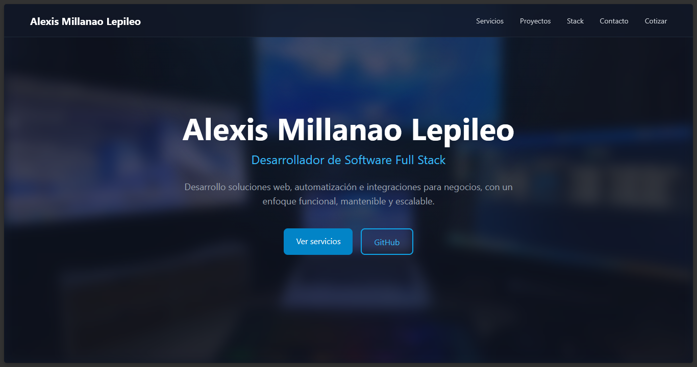

# Landing Page Showcase

Demo de landing page profesional con **Nuxt 3**, **Vue 3**, **TypeScript** y **Tailwind CSS**. Aplica Clean Architecture en frontend estático.

## Vista Previa



## Sobre el Proyecto

Proyecto muestra que demuestra cómo aplicar **Clean Architecture** en un frontend Nuxt 3. Separación clara de responsabilidades: UI pura en componentes, lógica de negocio en composables, datos en dominio.

## Stack

| Tecnología | Uso |
|-----------|-----|
| Nuxt 3 | Framework SSR/SSG |
| Vue 3 + Composition API | UI reactiva |
| Tailwind CSS 3 | Estilos utilitarios |
| TypeScript strict | Tipado estático |
| GitHub Actions | CI/CD automatizado |

## Highlights de Arquitectura

Adaptación de Clean Architecture para frontend estático:

```
Presentation → Application → Domain
(components)  (composables)  (types + data)
```

| Capa | Carpeta | Rol |
|------|---------|-----|
| **Domain** | `/types/` | Interfaces TypeScript puras |
| **Domain Data** | `/data/` | Mock data estratificado |
| **Application** | `/composables/` | Un composable por concepto |
| **Presentation** | `/components/` | Componentes Vue sin lógica de negocio |
| **Infrastructure** | `/pages/`, `/layouts/` | Ensamblaje Nuxt, SEO, rutas |

Decisión de diseño clave: **componentes nunca importan desde `/data/`**. Siempre usan composables. Así cambiar fuente de datos (archivo → API → CMS) sin tocar UI.

## Scripts

```bash
npm install        # Instalar dependencias
npm run dev        # Servidor desarrollo (http://localhost:3000)
npm run generate   # Build estático → .output/public/
```

## Licencia

MIT
